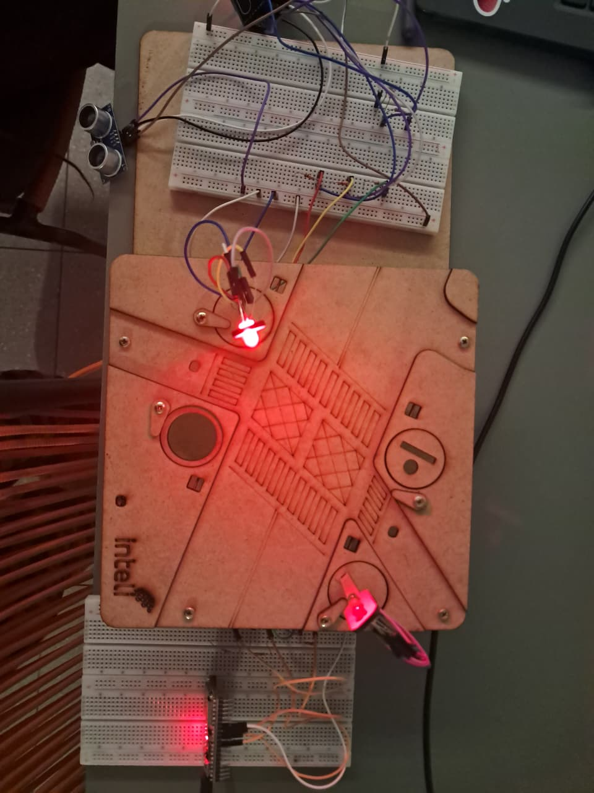
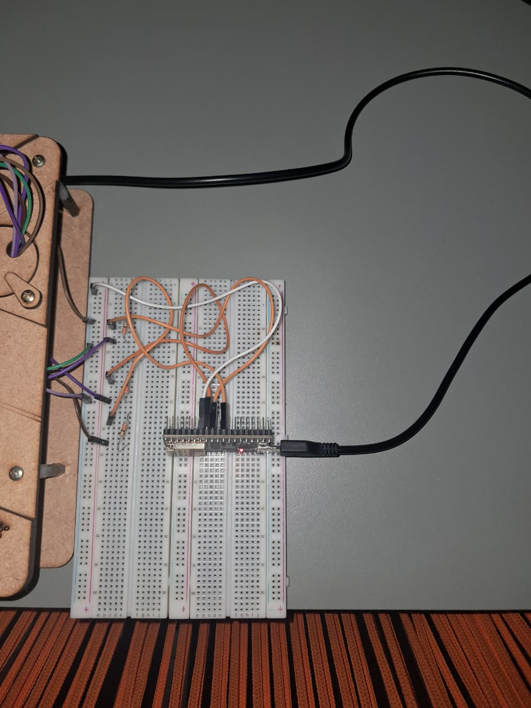

## Introdução
&emsp; O presente projeto trata-se do desenvolvimento de um semáforo inteligente, que se utiliza principalmente de dois microcontroladores ESP32, um sensor LDR e um sensor ultrassônico. Os conhecimentos aqui aplicados fazem referencia aos assuntos conceituados durantes as aulas de programação do módulo 4 das semana 1 à semana 5. 

</n>

## Parte 1: Montagem Física do Semáforo com LDR e Modo Noturno

&emsp; Para a realização da montagem física deste semáforo, nós utilizamos os seguintes componentes: 

</n>

|Quantidade | Componente | Finalidade|
|------------|---------------|----------|
| 2 |Microcontroladores ESP32| Conectividade Wi-Fi, responsável pela conexão do circuito |
| 1 | Sensor ultrassônico | Detectar quando um carro está próximo e ajustar o semáforo para facilitar o trânsito |
| 1 | Sensor LDR | Detectar se está dia ou noite e mudar o comportamento do semáforo com base nesses dados |
| 7 | Peças MDF | Para conectar os componetes do circuito, simulando a simulação do semáforo |
| 13 | Jumper (Macho-fêmea e Fêmea-fêmea) | Conectar os componentes do cuircuito |
| 7 | Resistor (10kOhms, 310Ohms e 330hms) | Transformar energia térmica e evitar a sobrecarga elétrica dos componentes |
| 2 | Cabo USB | Para alimentar os microcontroladores |
| 2| Protoboard | Para comportar os jumpers e resistores |

</n>

&emsp; O funcionamento do sensor LDR se faz por meio da alternância de resistência do circuito por meio da quantidade de luz emitida sobre ele. Dentro do projeto semáforo inteligente, o ele detecta essa quantidade de incidência de luz e ajusta o semáforo para comportar um fluxo de transito maior. 

</n>

&emsp; Mais detalhes sobre o funcionamento do semáforo inteligente podem ser encontradas por meio do seguinte código e fotos do semáforo:

</n>


``` .cpp

//Código do circuito principal

#include "UbidotsEsp32Mqtt.h"
#include <algorithm> // Necessário para a função de ordenação (sort)
/****************************************
 * DEFINIÇÕES E CONSTANTES
 ****************************************/
// --- Conectividade ---
const char *WIFI_SSID = "SHARE-RESIDENTE";
const char *WIFI_PASS = "Share@residente23";
const char *UBIDOTS_TOKEN = "BBUS-boCbKtwIQTK6MO6f1DuTtZbkS1cW1e";
// --- Ubidots ---
const char *DEVICE_LABEL_PUBLISH = "via-secundaria";
const char *VARIABLE_LABEL_CONTROLE = "controle";
const char *VARIABLE_LABEL_PRESENCA = "presenca-carro";
const char *VARIABLE_LABEL_LUMINOSIDADE = "luminosidade";
const char *CLIENT_ID = "esp32-mestre-duarte";
// --- Variáveis para Inscrição (Subscribe) ---
const char *DEVICE_LABEL_SUBSCRIBE = "via-secundaria";
const char *VAR_LABEL_EMERGENCIA_SUB = "modo-emergencia";
bool modoEmergenciaAtivo = false;
Ubidots ubidots(UBIDOTS_TOKEN, CLIENT_ID);
// --- Pinos ---
const int PIN_LDR = 34;
const int PIN_TRIG = 5;
const int PIN_ECHO = 21;
const int PIN_VERMELHO_M = 17;
const int PIN_AMARELO_M = 16;
const int PIN_VERDE_M = 4;
// --- Lógica do Semáforo ---
enum EstadoSemaforo { VERDE, AMARELO, VERMELHO, PISCA };
EstadoSemaforo estadoAtual = VERMELHO;
unsigned long tempoMudancaEstado = 0;
const unsigned long TEMPO_VERDE_MESTRE = 4000;
const unsigned long TEMPO_AMARELO_MESTRE = 2000;
const unsigned long TEMPO_VERMELHO_MESTRE = TEMPO_VERDE_MESTRE + TEMPO_AMARELO_MESTRE;
// --- Lógica do Modo Noturno e Sensor ---
const int LIMIAR_NOITE = 100;
const float LIMIAR_DISTANCIA = 100;
int modoOperacao = 0; // 0: Normal, 1: Noturno
const int NUM_LEITURAS_US = 5; // Número de leituras para tirar a média
const unsigned long TEMPO_CONFIRMACAO_PRESENCA = 1000;
bool presencaConfirmada = false;
unsigned long tempoPrimeiraDeteccao = 0;
/****************************************
 * FUNÇÃO DE CALLBACK
 ****************************************/
void callback(char *topic, byte *payload, unsigned int length) {
  String payloadStr;
  for (int i = 0; i < length; i++) {
    payloadStr += (char)payload[i];
  }
  int valorRecebido = payloadStr.toInt();
  Serial.printf("Recebido do tópico %s: %d\n", topic, valorRecebido);
  if (String(topic).indexOf(VAR_LABEL_EMERGENCIA_SUB) != -1) {
    if (valorRecebido == 1 && !modoEmergenciaAtivo) {
      Serial.println("MODO EMERGÊNCIA ATIVADO!");
      modoEmergenciaAtivo = true;
      publicarEstadoParaServo(PISCA);
    } else if (valorRecebido == 0 && modoEmergenciaAtivo) {
      Serial.println("Modo Emergência Desativado.");
      modoEmergenciaAtivo = false;
    }
  }
}
/****************************************
 * FUNÇÕES AUXILIARES
 ****************************************/
void publicarEstadoParaServo(EstadoSemaforo estadoServo) {
  ubidots.add(VARIABLE_LABEL_CONTROLE, estadoServo);
  ubidots.publish(DEVICE_LABEL_PUBLISH);
  Serial.printf("Publicando para servo: ESTADO %d\n", estadoServo);
}
void desligaSemaforoMestre() {
  digitalWrite(PIN_VERDE_M, LOW);
  digitalWrite(PIN_AMARELO_M, LOW);
  digitalWrite(PIN_VERMELHO_M, LOW);
}
// ===== NOVA FUNÇÃO DE LEITURA FILTRADA =====
float lerDistanciaFiltrada() {
  float leituras[NUM_LEITURAS_US];
  for (int i = 0; i < NUM_LEITURAS_US; i++) {
    digitalWrite(PIN_TRIG, LOW);
    delayMicroseconds(2);
    digitalWrite(PIN_TRIG, HIGH);
    delayMicroseconds(10);
    digitalWrite(PIN_TRIG, LOW);
    long duracao = pulseIn(PIN_ECHO, HIGH, 25000);
    leituras[i] = (duracao * 0.0343) / 2.0;
    delay(10);
  }
  std::sort(leituras, leituras + NUM_LEITURAS_US);
  float soma = 0;
  for (int i = 1; i < NUM_LEITURAS_US - 1; i++) {
    soma += leituras[i];
  }
  return soma / (NUM_LEITURAS_US - 2);
}
void atualizarSemaforo() {
  // (Esta função permanece inalterada)
  unsigned long tempoAtual = millis();
  switch (estadoAtual) {
    case VERDE:
      if (tempoAtual - tempoMudancaEstado >= TEMPO_VERDE_MESTRE) {
        estadoAtual = AMARELO;
        tempoMudancaEstado = tempoAtual;
        digitalWrite(PIN_VERDE_M, LOW);
        digitalWrite(PIN_AMARELO_M, HIGH);
        publicarEstadoParaServo(VERMELHO);
      }
      break;
    case AMARELO:
      if (tempoAtual - tempoMudancaEstado >= TEMPO_AMARELO_MESTRE) {
        estadoAtual = VERMELHO;
        tempoMudancaEstado = tempoAtual;
        digitalWrite(PIN_AMARELO_M, LOW);
        digitalWrite(PIN_VERMELHO_M, HIGH);
        publicarEstadoParaServo(VERDE);
        delay(TEMPO_AMARELO_MESTRE);
        publicarEstadoParaServo(AMARELO);
      }
      break;
    case VERMELHO:
      if (tempoAtual - tempoMudancaEstado >= TEMPO_VERMELHO_MESTRE) {
        estadoAtual = VERDE;
        tempoMudancaEstado = tempoAtual;
        digitalWrite(PIN_VERMELHO_M, LOW);
        digitalWrite(PIN_VERDE_M, HIGH);
        publicarEstadoParaServo(VERMELHO);
      }
      break;
    case PISCA:
      break;
  }
}
/****************************************
 * SETUP
 ****************************************/
void setup() {
  Serial.begin(115200);
  pinMode(PIN_VERMELHO_M, OUTPUT);
  pinMode(PIN_AMARELO_M, OUTPUT);
  pinMode(PIN_VERDE_M, OUTPUT);
  pinMode(PIN_TRIG, OUTPUT);
  pinMode(PIN_ECHO, INPUT);
  pinMode(PIN_LDR, INPUT);
  digitalWrite(PIN_VERMELHO_M, HIGH);
  tempoMudancaEstado = millis();
  ubidots.setDebug(true);
  ubidots.connectToWifi(WIFI_SSID, WIFI_PASS);
  ubidots.setCallback(callback);
  ubidots.setup();
  ubidots.reconnect();
  ubidots.subscribeLastValue(DEVICE_LABEL_SUBSCRIBE, VAR_LABEL_EMERGENCIA_SUB);
  publicarEstadoParaServo(VERDE);
}
/****************************************
 * LOOP PRINCIPAL
 ****************************************/
void loop() {
  if (!ubidots.connected()) {
    ubidots.reconnect();
    ubidots.subscribeLastValue(DEVICE_LABEL_SUBSCRIBE, VAR_LABEL_EMERGENCIA_SUB);
  }
  ubidots.loop();
  int valorLDR = analogRead(PIN_LDR);
  float distancia = lerDistanciaFiltrada();
  // Se o modo de emergência não estiver ativo, avalia as condições dos sensores
  if (!modoEmergenciaAtivo) {
    if (valorLDR < LIMIAR_NOITE) { // Se estiver escuro...
      // --- Lógica de Confirmação de Presença (Debounce) ---
      if (distancia < LIMIAR_DISTANCIA && distancia > 0) {
        if (tempoPrimeiraDeteccao == 0) { // Se for a primeira vez que detecta
          tempoPrimeiraDeteccao = millis(); // Marca o tempo
        } else if (millis() - tempoPrimeiraDeteccao > TEMPO_CONFIRMACAO_PRESENCA) {
          presencaConfirmada = true; // Confirma a presença após 1 segundo
        }
      } else {
        tempoPrimeiraDeteccao = 0;
        presencaConfirmada = false;
      }
      // --- Atuação baseada na presença confirmada ---
      if (presencaConfirmada) {
        if (modoOperacao == 1) {
          Serial.println("Presença CONFIRMADA no escuro. Retornando ao Modo Normal.");
          modoOperacao = 0;
          estadoAtual = VERMELHO;
          tempoMudancaEstado = millis();
          desligaSemaforoMestre();
          digitalWrite(PIN_VERMELHO_M, HIGH);
          publicarEstadoParaServo(VERDE);
        }
      } else { // Se não há presença confirmada
        if (modoOperacao == 0) {
          Serial.println("Escuro e sem presença. Entrando no Modo Noturno (Pisca).");
          modoOperacao = 1;
          desligaSemaforoMestre();
          publicarEstadoParaServo(PISCA);
        }
      }
    } else { // Se estiver claro
      if (modoOperacao == 1) {
        Serial.println("Clareou. Retornando ao Modo Normal.");
        modoOperacao = 0;
        estadoAtual = VERMELHO;
        tempoMudancaEstado = millis();
        desligaSemaforoMestre();
        digitalWrite(PIN_VERMELHO_M, HIGH);
        publicarEstadoParaServo(VERDE);
      }
      modoOperacao = 0;
      presencaConfirmada = false;
      tempoPrimeiraDeteccao = 0;
    }
  }
  // --- LÓGICA DE EXECUÇÃO UNIFICADA ---
  if (modoEmergenciaAtivo || modoOperacao == 1) {
    unsigned long t = millis();
    bool pisca = (t / 500) % 2;
    digitalWrite(PIN_AMARELO_M, pisca);
    digitalWrite(PIN_VERDE_M, LOW);
    digitalWrite(PIN_VERMELHO_M, LOW);
  } else {
    atualizarSemaforo();
  }
  // Publicação de dados dos sensores
  static unsigned long ultimoEnvio = 0;
  if (millis() - ultimoEnvio > 5000) {
    ultimoEnvio = millis();
    ubidots.add(VARIABLE_LABEL_LUMINOSIDADE, valorLDR);
    ubidots.add(VARIABLE_LABEL_PRESENCA, presencaConfirmada ? 1.0 : 0.0);
    if (!ubidots.publish(DEVICE_LABEL_PUBLISH)) {
      Serial.println("Falha ao publicar dados dos sensores!");
    }
  }
}

```
</n>

``` .cpp

//Código do circuito secundário

#include "UbidotsEsp32Mqtt.h"
/****************************************
 * DEFINIÇÕES E CONSTANTES
 ****************************************/
// --- Conectividade ---
const char* WIFI_SSID = "SHARE-RESIDENTE"; // Insira o nome da sua rede Wi-Fi
const char* WIFI_PASS = "Share@residente23"; // Insira a senha da sua rede Wi-Fi
const char* UBIDOTS_TOKEN = "BBUS-boCbKtwIQTK6MO6f1DuTtZbkS1cW1e"; // Seu Token Ubidots
// --- Ubidots ---
const char* CLIENT_ID = "esp32-servo-duarte";
const char* DEVICE_LABEL_SUBSCRIBE = "via-secundaria";
const char* VAR_LABEL_CONTROLE_SUB = "controle";
const char* VAR_LABEL_EMERGENCIA_SUB = "modo-emergencia";
Ubidots ubidots(UBIDOTS_TOKEN, CLIENT_ID);
// --- Pinos ---
const int PIN_VERMELHO_S = 19;
const int PIN_AMARELO_S = 18;
const int PIN_VERDE_S = 17;
// --- Estados ---
enum EstadoSemaforo { VERDE, AMARELO, VERMELHO, PISCA };
bool modoPiscaAtivo = false;
bool emergenciaAtivadaPorBotao = false;
/****************************************
 * FUNÇÃO DE CALLBACK
 ****************************************/
void callback(char *topic, byte *payload, unsigned int length) {
  String payloadStr;
  for (int i = 0; i < length; i++) {
    payloadStr += (char)payload[i];
  }
  int valorRecebido = payloadStr.toInt();
  Serial.printf("Recebido do tópico %s: %d\n", topic, valorRecebido);
  // Seção que trata o botão de emergência
  if (String(topic).indexOf(VAR_LABEL_EMERGENCIA_SUB) != -1) {
    if (valorRecebido == 1) {
      Serial.println("EMERGÊNCIA MANUAL ATIVADA. Forçando modo pisca.");
      emergenciaAtivadaPorBotao = true;
      modoPiscaAtivo = true;
    } else {
      Serial.println("Emergência manual desativada. Retornando controle ao mestre.");
      emergenciaAtivadaPorBotao = false;
      digitalWrite(PIN_VERDE_S, LOW);
      digitalWrite(PIN_AMARELO_S, LOW);
      digitalWrite(PIN_VERMELHO_S, LOW);
    }
    return; // Sai após tratar a emergência
  }
  // Seção que trata os comandos do mestre
  if (String(topic).indexOf(VAR_LABEL_CONTROLE_SUB) != -1) {
    // IGNORA o mestre APENAS se a emergência MANUAL estiver ativa.
    if (emergenciaAtivadaPorBotao) {
      Serial.println("Comando do mestre ignorado, pois a emergência manual está ativa.");
      return;
    }
    // Se a emergência manual não estiver ativa, obedece ao mestre.
    switch (valorRecebido) {
      case VERDE:
        modoPiscaAtivo = false;
        digitalWrite(PIN_VERDE_S, HIGH);
        digitalWrite(PIN_AMARELO_S, LOW);
        digitalWrite(PIN_VERMELHO_S, LOW);
        break;
      case AMARELO:
        modoPiscaAtivo = false;
        digitalWrite(PIN_VERDE_S, LOW);
        digitalWrite(PIN_AMARELO_S, HIGH);
        digitalWrite(PIN_VERMELHO_S, LOW);
        break;
      case VERMELHO:
        modoPiscaAtivo = false;
        digitalWrite(PIN_VERDE_S, LOW);
        digitalWrite(PIN_AMARELO_S, LOW);
        digitalWrite(PIN_VERMELHO_S, HIGH);
        break;
      case PISCA: // Comando vindo do modo noturno do mestre
        modoPiscaAtivo = true;
        break;
    }
  }
}
/****************************************
 * SETUP
 ****************************************/
void setup() {
  Serial.begin(115200);
  pinMode(PIN_VERMELHO_S, OUTPUT);
  pinMode(PIN_AMARELO_S, OUTPUT);
  pinMode(PIN_VERDE_S, OUTPUT);
  digitalWrite(PIN_VERDE_S, LOW);
  digitalWrite(PIN_AMARELO_S, LOW);
  digitalWrite(PIN_VERMELHO_S, LOW);
  ubidots.setDebug(true);
  ubidots.connectToWifi(WIFI_SSID, WIFI_PASS);
  ubidots.setCallback(callback);
  ubidots.setup();
  ubidots.reconnect();
  ubidots.subscribeLastValue(DEVICE_LABEL_SUBSCRIBE, VAR_LABEL_CONTROLE_SUB);
  ubidots.subscribeLastValue(DEVICE_LABEL_SUBSCRIBE, VAR_LABEL_EMERGENCIA_SUB);
}
/****************************************
 * LOOP PRINCIPAL
 ****************************************/
void loop() {
  if (!ubidots.connected()) {
    ubidots.reconnect();
    ubidots.subscribeLastValue(DEVICE_LABEL_SUBSCRIBE, VAR_LABEL_CONTROLE_SUB);
    ubidots.subscribeLastValue(DEVICE_LABEL_SUBSCRIBE, VAR_LABEL_EMERGENCIA_SUB);
  }
  ubidots.loop();
  if (modoPiscaAtivo) {
    unsigned long tempoAtual = millis();
    bool ledAceso = (tempoAtual / 500) % 2;
    digitalWrite(PIN_AMARELO_S, ledAceso);
    digitalWrite(PIN_VERDE_S, LOW);
    digitalWrite(PIN_VERMELHO_S, LOW);
  }
}

```

</n>

<p align = center> Figura 1 - Foto do circuito completo </p>



<p align = center> Fonte: foto produzida pelos próprios autores (2025) </p>

</n>

<p align = center> Figura 2 - Foto do circuito principal </p>


<p align = center> Fonte: foto produzida pelos próprios autores (2025) </p>

</n>

<p align = center> Figura 3 - Foto do circuito secundário </p>



<p align = center> Fonte: foto produzida pelos próprios autores (2025) </p>

</n>

## Parte 2: Configuração da Interface Online

</n>

&emsp; Para a configuração da interface online nós utilizamos o software online Ubidots. Logo abaixo, podem ser encontrados mais detalhes da interface. 

</n>

<p align = center> Figura 4 - Plataforma Ubidots sem alterações no sensor LDR </p>


<p align = center> Fonte: foto produzida pelos próprios autores (2025) </p>

</n>

<p align = center> Figura 5 - Plataforma Ubidots com alterações no sensor LDR </p>


<p align = center> Fonte: foto produzida pelos próprios autores (2025) </p>

</n> 

&emsp; Para melhor visualização dos dados obtidos, podem ser encontradas mais imagens abaixo, bem como o vídeo demonstrativo: 

</n>

Link do vídeo: https://drive.google.com/file/d/1LN3um2UHB0v_a5Ks0nraQ7d6hUeohxpS/view?usp=sharing

Link da plataforma UBIDOTS: https://inteli-ubidots.iot-application.com/app/dashboards/public/dashboard/kCUB8FtlhP12J1oqvo7KqAnrBm04qHb5FxrUIbH3eYg?navbar=true&contextbar=false&layersBar=false

</n>


